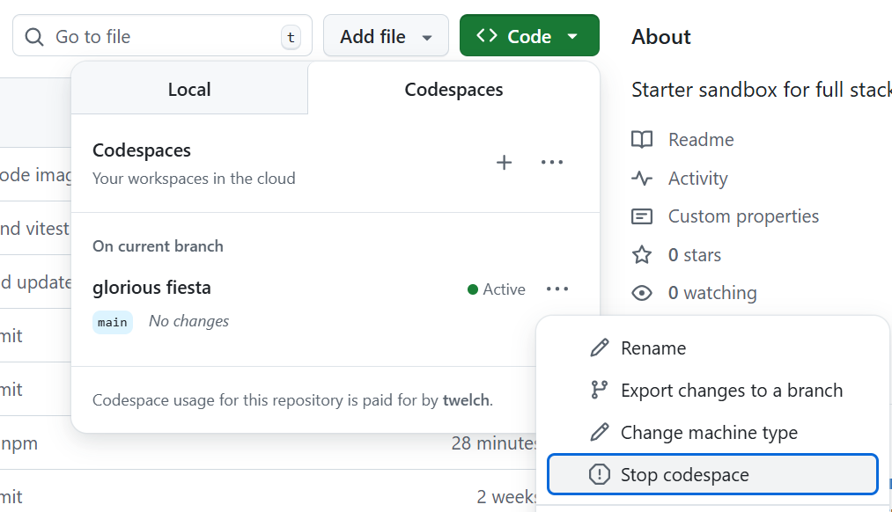

This is a starter [Next.js](https://nextjs.org) app containing a simple form and server-side action. To work with this app in Github Codespaces:

* First, make sure you are logged into Github and viewing this repository.
* Next, click the `Code` button and then `Create codespace on main`


* This will create a Codespace and either direct you to a browser-based version of the VSCode editor or, if you have VSCode installed locally, it will ask if you want to open it in VSCode


* It may then ask you to install the Github Codespaces extension
* Your codespace should now be ready
* Open a new terminal in VSCode if not already open, using `View -> Terminal` or simply `Ctrl-J`
* Next, make sure you can install dependencies, run tests, and start a development server

```bash
npm install
npm test
npm run dev
```

* Click the popup to "Open in Browser" and it should load the app.  Start and complete an assessment.
* Try making edits to  `app/page.tsx`, `app/assessment/page.tsx`, or `app/actions/assessment.ts`. The page auto-updates as you save changes.  
* Make sure to stop your codespace when you are done.


